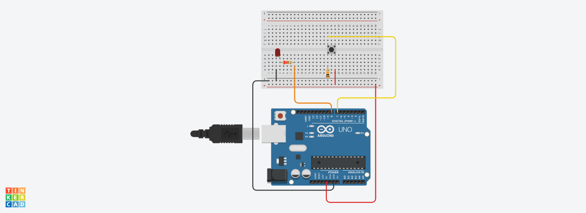

# Task1_Electronics_and_electrical_engineering
## **Description**
In this task the light turns on when the button is pressed.

## **Circuit**
In these circuit we use these components:
1. 1 Arduino board
1. 1 Breadboard 
1. 2 Resistors 
1. 1 Push button
1. 1 LED
1. Normal wires

